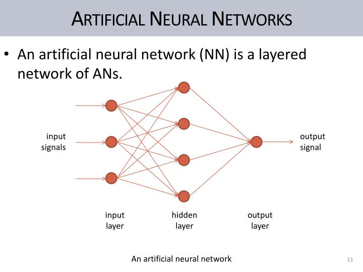
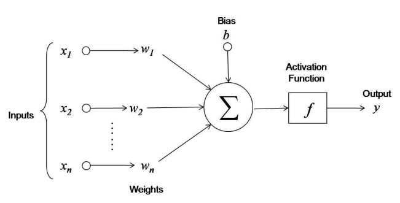
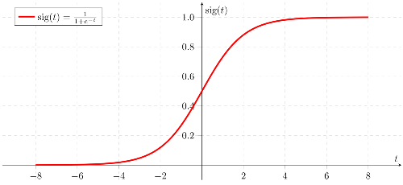

## Neural Network in C++. 

An ANN (Artificial Neural Network) is based on a collection of connected units or nodes called artificial neurons, which loosely model the neurons in a biological brain.

### TODOS:

+ Optimize memory manipulation in matrix operations.
+ CSV or YAML input files for training data.
+ Exportable Neuron Data.
+ AUC (Area Under the Curve) and Accuracy metrics.

## Working.

### Simple Neural Net Structure.
<br />

<center> 
    
    <p><i>Figure. 1. Simple Neural Network Structure.</i></p>
</center>


Based on nature, neural networks are the usual representation we make of the brain: *Neurons interconnected to other neurons which forms a network.* The AN's are composed of various layers containing **n** number of neurons.

Neural networks can usually be read from left to right. Here, the first layer is the layer in which inputs are entered. There are **n** amount of internals layers (called hidden layers) that do some math (in this case ther is only one), and one last layer that contains all the possible outputs.

### How neurons perform their operations?
<center> 
    
    <p><i>Figure. 2. Neurons inner operations.</i></p>
</center>

First, the nueron adds up the value of every neurons from the previous column it is connected to. On the Figure 2, there are 3 inputs *(x1, x2, x3)* coming to the neuron, so 3 neurons of the previous column are connected to our neuron.

This value is multiplied, before being added, by another variable called “weight” *(w1, w2, w3)* which determines the connection between the two neurons. Each connection of neurons has its own weight, and those are the only values that will be modified during the learning process.

Moreover, a bias value may be added to the total value calculated. It is not a value coming from a specific neuron and is chosen before the learning phase, but can be useful for the network.

After all those summations, the neuron finally applies a function called “activation function” to the obtained value.

<center> 
    
    <p><i>Figure. 3. Sigmoid activation function.</i></p>
</center>

The so-called activation function usually serves to turn the total value calculated before to a number between 0 and 1 (done for example by a sigmoid function shown by Figure 3). Other function exist and may change the limits of our function, but keeps the same aim of limiting the value.

<center>
    
    <p><i>Figure. 4. Neuron Operations.</i></p>
</center>

The product of the input neurons and the weights can be represented by a matrix. To calculate the c[i,j] entry of the matrix C:=AB, one takes the dot product of the i'th row of the matrix A with the j'th column of the matrix B. For the dot product to be succesfuly performed, the rows of matrix A and columns of matrix B must have the same length.
 
            | (W11 * I1) + (W21 * i2) + ... + (Wi1 * Ii) | 
            | (W12 * I1) + (W22 * i2) + ... + (Wi2 * Ii) |    
        C = | (W13 * I1) + (W23 * i2) + ... + (Wi3 * Ii) |
            |            ·            + ... +            |
            | (W1j + I1) + (W2j * I2) + ... + (Wij + Ii) |

Being the code equivalent in this library as:
```c++
// Being T a generic Type. (Float, Double, Int ...) 
Matrix<T>* hidden_input_weights = Matrix<T>::dot(this->inputHiddenWeights, inputs);
```

Now, to add the bias:
```c++
hidden_input_weights->add(this->bias_hidden);
```

And finally pass it through the activation function.
```c++
this->hidden_weights_output = Matrix<T>::map(hidden_input_weights, sigmoid);
```
References:
[1]: https://towardsdatascience.com/first-neural-network-for-beginners-explained-with-code-4cfd37e06eaf