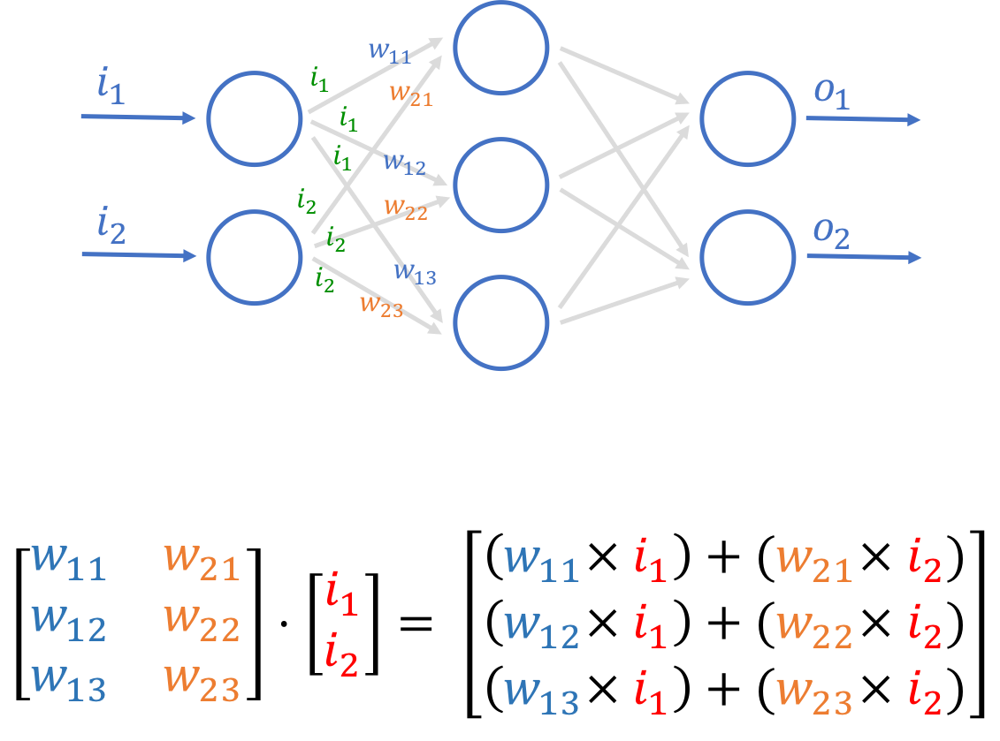

## Neural Network in C++. 

An ANN (Artificial Neural Network) is based on a collection of connected units or nodes called artificial neurons, which loosely model the neurons in a biological brain.

#### Simple Neural Net Structure.
<br />

<center> 
    
    <p><i>Figure. 1. Simple Neural Network Structure.</i></p>
</center>


Based on nature, neural networks are the usual representation we make of the brain: *Neurons interconnected to other neurons which forms a network.* The AN's are composed of various layers containing **n** number of neurons.

Neural networks can usually be read from left to right. Here, the first layer is the layer in which inputs are entered. There are **n** amount of internals layers (called hidden layers) that do some math (in this case ther is only one), and one last layer that contains all the possible outputs.

### How neurons perform their operations?
<center> 
    
    <p><i>Figure. 2. Neurons inner operations.</i></p>
</center>

First, the nueron adds up the value of every neurons from the previous column it is connected to. On the Figure 2, there are 3 inputs *(x1, x2, x3)* coming to the neuron, so 3 neurons of the previous column are connected to our neuron.

This value is multiplied, before being added, by another variable called “weight” *(w1, w2, w3)* which determines the connection between the two neurons. Each connection of neurons has its own weight, and those are the only values that will be modified during the learning process.

Moreover, a bias value may be added to the total value calculated. It is not a value coming from a specific neuron and is chosen before the learning phase, but can be useful for the network.

After all those summations, the neuron finally applies a function called “activation function” to the obtained value.

<center> 
    
    <p><i>Figure. 3. Sigmoid activation function.</i></p>
</center>

The so-called activation function usually serves to turn the total value calculated before to a number between 0 and 1 (done for example by a sigmoid function shown by Figure 3). Other function exist and may change the limits of our function, but keeps the same aim of limiting the value.

<center>
    
    <p><i>Figure. 4. Neuron Operations.</i></p>
</center>

The product of the input neurons and the weights can be represented by a matrix. To calculate the c[i,j] entry of the matrix C:=AB, one takes the dot product of the i'th row of the matrix A with the j'th column of the matrix B. For the dot product to be succesfuly performed, the rows of matrix A and columns of matrix B must have the same length.
 
            | (W11 * I1) + (W21 * i2) + ... + (Wi1 * Ii) | 
            | (W12 * I1) + (W22 * i2) + ... + (Wi2 * Ii) |    
        C = | (W13 * I1) + (W23 * i2) + ... + (Wi3 * Ii) |
            |            ·            + ... +            |
            | (W1j + I1) + (W2j * I2) + ... + (Wij + Ii) |


#### Terminology

```math
i = \text{Number of Input layer Nodes} \\
h_n = \text{Number of the nth Hidden layer Nodes} \\
o = \text{Number of the nth Output layer Nodes} \\
\vec{V}^i = \text{Input Vector} \\
\vec{V}^o = \text{Output Vector} \\
\vec{V}^{b_{n}} = \text{Bias Vector} \\
\vec{B}^{ih} = \text{Input-Hidden Product Bias Vector}  \\
\vec{B}^{h_nh_{n+1}} = \text{Hidden-Hidden+1 Product Bias Vector}  \\
\vec{B}^{h_{n}o} = \text{Hidden-Ouptut Product Bias Vector}  \\
Z^{o_e} \text{Output Error Vector} \\
M^{ih_{0}} = \text{Input-Hidden Matrix} \\
M^{h_nh_{n+1}} = \text{nth Hidden to nth+1 Hidden Layer Matrix} \\
M^{h_no} = \text{Hidden-Output Matrix} \\
O^{ih_{0}} = \text{Output from the Input-Hidden layer product} \\
O^{h_nh_{n+1}} = \text{Output from the Hidden-Hidden+1 layer product} \\
O^{h_no} = \text{Output from the Hidden-Output layer product} \\
E^{h_nh_{n+1}} = \text{nth Hidden to nth+1 Hidden layer Error} \\
E^{h_no} = \text{nth Hidden-Output layer Error} \\
\vec{E}^{o} = \text{Output Error Vector} \\
m = \text{Individual Matrix Cell/Unit} \\
m' = \text{Individual Matrix Cell/Unit mapped with the Activation Function} \\
```

#### Creating a Neural Network
```c++
std::vector<uint_fast64_t> hidden_layers = {4, 4};
NeuralNetwork<float> *nn = new NeuralNetwork<float>(2, hidden_layers, 1);
```

Which will populate the weight matrices for the input-hidden layer ($ M^{ih_{0}} $), nth hidden layers ($ M^{hn} $) and hidden-output layer ($ M^{h_{0}o} $), where the $ M^{h_{n+1}} $ hidden layer has dimensions $ M^{h_{n+1}} \times M^{h_n} $

#### Feed-Forward
The feed-forward algorithm produces an output vector given an input vector, being the calculated value for each cell in the resulting matrix (cell)

```math
m_{j} = M^{ih_{0}}_{ji} + \sum_{i=0}^{I-1}\vec{V}^i_{j} M^{ih_{0}}_{ij}
```

Mapping the cell with an activation function which ends up calculating the hidden node value ($ h_j $)

```math
m' = f(m_{j})
```

Which by using matrix-vector multiplication, the value of all hidden nodes h can be calculated in a single operation (e.g. simple neural network with one hidden layer)

```math
O^{ih_{0}} = F(M^{ih_{0}} \times \vec{V}^i + \vec{V}^b)
```

```c++
Matrix<T>* hidden_input_weights = Matrix<T>::dot(this->inputHiddenWeights, inputs);
hidden_input_weights->add(this->bias_hidden);
this->hidden_weights_output = Matrix<T>::map(hidden_input_weights, sigmoid);
```

Where F() is the vector function that takes f() on all elements of it’s argument and B the bias matrix.

```math
\vec{V}^o = F( M^{h_{}o} \times O^{ih_{0}})
```

#### Backpropagation

###### Cost Function
A cost function is a measure of how well a machine learning model performs by quantifying the difference between predicted and actual outputs. Its goal is to be minimized by adjusting the model’s parameters during training.

‘Loss’ in Machine learning helps us understand the difference between the predicted value & the actual value.

* Loss function: Used when we refer to the error for a single training example.
* Cost function: Used to refer to an average of the loss functions over an entire training dataset.

There are many cost functions in machine learning and each has its use cases depending on whether it is a regression problem or classification problem.

* Regression cost Function
  * Mean Error (ME)
  * Mean Squared Error (MSE)
  * Mean Absolute Error (MAE)
* Binary Classification cost Functions
* Multi-class Classification cost Functions

Recovered from: https://www.analyticsvidhya.com/blog/2021/02/cost-function-is-no-rocket-science/

###### Gradient Descent
For the following network 

#### Optimizations
this neural network implementation will keep track of all errors, gradients and deltas that are calculated once the backpropagation algorithm is performed. These matrices dimensions can be calculated at creation time to optimize memory allocation count and time, since allocations are quite expensive.

e.g. using a 2 input layer, 2x3 hidden layers ($ h_{0} $ and $ h_{1} $) and 2 output layers: 

**Weights pre-allocations**
```math
[M^{ih_{0}}, M^{h_0h_{1}}, M^{h_{1}o}, \vec{V}^o] \implies{[(h_0,i), (h_1,h_0), (o,h_1), (1,o)]} \implies{[(3 \times 2), (3 \times 3), (2 \times 3), (2 \times 1)]}
```
**Biases pre-allocations**
```math
[\vec{B}^{ih},\vec{B}^{h_0h_{1}},\vec{B}^{h_{1}o}] \implies [(h_0,1),(h_1,1),(o,1)] \implies [(3 \times 1), (3 \times 1), (2 \times 1)] \\
```
**Weight product pre-allocations**
```math
[O^{ih_{0}}(M^{ih_{0}} \times \vec{V}^i),O^{h_0h_{1}}(M^{h_0h_{1}} \times O^{ih_{0}}),O^{h_1o}(M^{h_{1}o} \times O^{h_0h_{1}})] \implies [(3 \times 1), (3 \times 1), (2 \times 1)] \\

\text{1st operation} = (3 \times 2) \times (2 \times 1) = (3 \times 1) \\
\text{2nd operation} = (3 \times 3) \times (3 \times 1) = (3 \times 1) \\
\text{3rd operation} = (2 \times 3) \times (3 \times 1) = (2 \times 1) \\

```
**Errors pre-allocations**
```math
\text{Dimensions must match with the feed-forward output products.} \\
[E^{h_0h_{1}}=(M^{h_0h_{1}}_T \times E^{h_1o}), E^{h_1o}=(M^{h_1o}_T \times \vec{E}^{o}), \vec{E}^{o}] \implies{[(3 \times 1), (3 \times 1), (2 \times 1)]}
```
**Gradients pre-allocations**
```math
\text{Dimensions must match with the biases.} \\
[\nabla O^{ih_{0}} (\vec{B}^{ih}), \nabla O^{h_0h_{1}}(\vec{B}^{h_0h_{1}}), \nabla O^{h_1o}(\vec{B}^{h_{1}o})] \implies [(3 \times 1), (3 \times 1), (2 \times 1)]
```
**Deltas pre-allocations** 
```math
\text{Dimensions must match with the weights.} \\
[M^{ih_{0}}, M^{h_0h_{1}}, M^{h_{1}o}] \implies{[(h_0,i), (h_1,h_0), (o,h_1)]} \implies{[(3 \times 2), (3 \times 3), (2 \times 3)]}

```

#### TODOS:

+ Optimize memory manipulation in matrix operations.
+ CSV or YAML input files for training data.
+ Exportable Neuron Data.
+ AUC (Area Under the Curve) and Accuracy metrics.

References:
[1]: https://towardsdatascience.com/first-neural-network-for-beginners-explained-with-code-4cfd37e06eaf

Helpful statements:
//"program": "${workspaceRoot}/out/build/${command:cmake.buildType}/${env:OS}/NeuralNetworkd",
//"preLaunchTask": "cmake",
https://wang-yimu.com/a-tutorial-on-shared-memory-inter-process-communication/